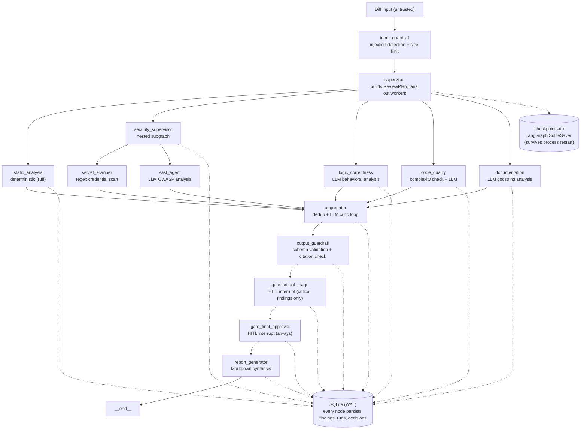

# Argus — Multi-Agent AI Code Review System

> *Panoptes, the all-seeing: many specialized eyes, one accountable supervisor.*

Argus is a **production-grade, LangGraph-orchestrated multi-agent code review system** built as a portfolio demonstration of applied multi-agent systems engineering. It runs five parallel worker agents, a nested security subgraph, human-in-the-loop approval gates, and durable checkpointing — all on free-tier LLMs, with a FastAPI service layer and a CLI.

---

## Architecture





Five portfolio signals, each demonstrably implemented:

| Signal | Implementation |
|--------|---------------|
| **Multi-agent orchestration** | Supervisor + 5 parallel workers via `Send()` fan-out; one nested Security subgraph |
| **Human-in-the-loop** | Two `interrupt()` gates, resumable after process restart via SqliteSaver |
| **Durable checkpointing** | `SqliteSaver` against `checkpoints.db`; HITL + checkpoint work *together*, not separately |
| **Guardrails** | Input: injection detection, size limit. Output: schema validation, hallucination/citation check, secret redaction |
| **Observability** | `structlog` + OpenTelemetry (`@traced_node` decorator, zero changes to node body) + Prometheus metrics |

---

## Quick Start

### Prerequisites

- Python ≥ 3.11
- A free [Groq API key](https://console.groq.com/) (primary LLM)
- Optionally a free [Gemini API key](https://aistudio.google.com/) (fallback)

### Install

```bash
git clone <repo>
cd argus
pip install -e ".[dev]"
cp .env.example .env
# Edit .env — set ARGUS_GROQ_API_KEY (and optionally ARGUS_GEMINI_API_KEY)
```

### Run a review (CLI — fastest path)

```bash
# Review a diff file
argus review --diff fixtures/sample.patch

# Pipe from git
git diff main...feature | argus review --stdin

# JSON output (for CI integration)
git diff HEAD~1 | argus review --stdin --json

# Gate CI on critical findings
argus review --diff pr.patch --fail-on critical
```

No API keys configured? Argus still runs the deterministic agents (ruff, secret scanner) and returns whatever they find. LLM agents degrade gracefully to empty findings.

### Start the API server

```bash
argus serve --host 0.0.0.0 --port 8000
```

### API usage

```bash
# Submit a review
curl -X POST http://localhost:8000/reviews \
  -H "x-api-key: dev-secret-key" \
  -H "Content-Type: application/json" \
  -d '{"diff": "<unified diff>", "repo": "owner/repo", "pr_number": 1}'

# Poll status
curl http://localhost:8000/reviews/<id> -H "x-api-key: dev-secret-key"

# Stream SSE progress
curl -N http://localhost:8000/reviews/<id>/stream -H "x-api-key: dev-secret-key"

# Resume a paused HITL gate
curl -X POST http://localhost:8000/reviews/<id>/resume \
  -H "x-api-key: dev-secret-key" \
  -H "Content-Type: application/json" \
  -d '{"decision": {"gate": "final_approval", "action": "approve"}}'

# Fetch report
curl http://localhost:8000/reviews/<id>/report -H "x-api-key: dev-secret-key"

# Prometheus metrics
curl http://localhost:8000/metrics
```

---

## Project Structure

```
argus/
├── src/argus/
│   ├── config.py                     # pydantic-settings (ARGUS_* env vars)
│   ├── cli.py                        # Typer CLI: review / serve / parse-comment
│   │
│   ├── agents/
│   │   ├── base.py                   # BaseAgent Protocol (async run → Finding[])
│   │   ├── registry.py               # Plugin-style agent registry
│   │   ├── aggregator.py             # Dedup + LLM critic loop
│   │   ├── report_generator.py       # Markdown report synthesis
│   │   ├── static_analysis/agent.py  # Deterministic ruff wrapper
│   │   ├── security/
│   │   │   ├── secret_scanner.py     # Regex credential scanner
│   │   │   ├── sast_agent.py         # LLM OWASP vulnerability analysis
│   │   │   └── supervisor.py         # Security nested subgraph
│   │   ├── logic/agent.py            # LLM behavioral bug detection
│   │   ├── code_quality/agent.py     # Cyclomatic complexity + LLM style
│   │   └── documentation/agent.py   # LLM docstring / README analysis
│   │
│   ├── graph/
│   │   ├── state.py                  # ReviewState TypedDict (all graph state)
│   │   ├── graph.py                  # Full LangGraph assembly + compile_graph()
│   │   ├── checkpointer.py           # SqliteSaver factory
│   │   └── nodes/
│   │       ├── guardrail.py          # Input guardrail node
│   │       ├── supervisor.py         # Supervisor node (plan + fan-out)
│   │       ├── workers.py            # Worker node factory
│   │       ├── aggregator.py         # Aggregator node + all routing functions
│   │       ├── hitl.py               # HITL gate nodes (interrupt-based)
│   │       └── report.py             # Report generator node
│   │
│   ├── guardrails/
│   │   ├── schemas.py                # All Pydantic v2 contracts
│   │   ├── input.py                  # Injection detection + diff size limits
│   │   └── output.py                 # Citation check + secret redaction
│   │
│   ├── llm/
│   │   ├── provider.py               # LLMProvider protocol, GroqProvider, GeminiProvider
│   │   ├── rate_limiter.py           # Async token-bucket rate limiter
│   │   └── router.py                 # Primary→fallback routing + tenacity retry
│   │
│   ├── persistence/
│   │   ├── models.py                 # SQLModel table definitions (WAL mode)
│   │   └── db.py                     # Engine factory + session context manager
│   │
│   ├── observability/
│   │   ├── logging.py                # structlog config (review_id-bound context)
│   │   ├── tracing.py                # OpenTelemetry provider setup
│   │   ├── metrics.py                # Prometheus counters + histograms
│   │   └── decorators.py             # @traced_node (zero changes to node body)
│   │
│   ├── api/
│   │   ├── app.py                    # FastAPI application (lifespan, /metrics)
│   │   ├── deps.py                   # Shared dependencies (auth, router)
│   │   └── routers/
│   │       ├── reviews.py            # POST/GET /reviews
│   │       ├── approvals.py          # POST /reviews/{id}/resume
│   │       └── stream.py             # GET /reviews/{id}/stream (SSE)
│   │
│   └── eval/
│       └── offline/
│           ├── harness.py            # Precision/recall/F1 per category
│           └── judge.py              # LLM-as-judge + deterministic matching
│
├── eval_datasets/                    # 15 versioned fixture PRs with hand labels
├── fixtures/sample.patch             # Demo diff (SQL injection + leaked secret)
├── tests/
│   ├── unit/                         # 13 test modules, all mocked
│   ├── integration/                  # API, CLI, graph E2E, observability
│   └── eval/                         # Offline harness tests
├── docs/DEMO.md                      # Scripted walkthrough for interviewers
├── .github/workflows/argus-review.yml
└── .env.example                      # All ARGUS_* settings documented
```

---

## Configuration

All settings use the `ARGUS_` prefix. Copy `.env.example` to `.env` and edit.

| Variable | Default | Description |
|---|---|---|
| `ARGUS_GROQ_API_KEY` | — | Groq API key (primary LLM) |
| `ARGUS_GEMINI_API_KEY` | — | Gemini API key (fallback LLM) |
| `ARGUS_PRIMARY_PROVIDER` | `groq` | Primary LLM provider |
| `ARGUS_FALLBACK_PROVIDER` | `gemini` | Fallback LLM provider |
| `ARGUS_DB_PATH` | `data/argus.db` | SQLite domain DB path |
| `ARGUS_CHECKPOINTS_DB_PATH` | `data/checkpoints.db` | LangGraph checkpoint DB |
| `ARGUS_RATE_LIMIT_RPM` | `30` | Requests per minute per provider |
| `ARGUS_MAX_RETRIES` | `3` | LLM call retry attempts |
| `ARGUS_RETRY_BASE_DELAY` | `1.0` | Backoff base delay (seconds) |
| `ARGUS_RETRY_MAX_DELAY` | `30.0` | Backoff max delay (seconds) |
| `ARGUS_MAX_DIFF_LINES` | `2000` | Diff size limit (lines) |
| `ARGUS_COMPLEXITY_THRESHOLD` | `10` | Cyclomatic complexity gate |
| `ARGUS_API_KEY` | `dev-secret-key` | REST API key (change in production) |
| `ARGUS_MAX_REFINE_ITERATIONS` | `3` | Aggregator critic loop bound |
| `ARGUS_MAX_REPORT_ITERATIONS` | `3` | Report self-heal loop bound |

---

## Testing

```bash
# Full suite (292 tests, zero API keys required)
pytest tests/ -v

# Unit tests only
pytest tests/unit/ -v

# Integration tests (graph, API, CLI, observability)
pytest tests/integration/ -v

# Evaluation harness
pytest tests/eval/ -v
```

All LLM calls are mocked. No real API keys needed to run tests.

---

## Milestones Implemented

| # | Milestone | What it proves |
|---|---|---|
| M1 | Project setup, config, schemas, DB, checkpointer | Foundation |
| M2 | LLM gateway (Groq + Gemini, rate limiter, retry) | Provider abstraction |
| M3 | Guardrails (input injection, output redaction/citation) | Trust boundary |
| M4 | Agent protocol, registry, static analysis agent | Deterministic baseline |
| M5 | Logic, code quality, documentation LLM agents | Parallel worker pattern |
| M6 | Security subgraph (secret scanner, SAST, supervisor) | Nested multi-agent |
| M7 | Graph state, supervisor fan-out, worker nodes | Orchestration |
| M8 | Aggregator (dedup + critic loop), routing functions | Bounded refinement |
| M9 | HITL gates (interrupt-based), durable resume | Human-in-the-loop |
| M10 | Report generator, full graph E2E | End-to-end correctness |
| M11 | FastAPI service (REST + SSE + approval) | API surface |
| M12 | Observability (structlog + OTel + Prometheus) | Observability |
| M13 | CLI + GitHub Actions CI workflow | CI integration |
| M14 | Offline evaluation harness (precision/recall/F1) | Eval-driven development |
| M15 | Polish, docs, clean linting, resume readiness | This milestone |

---

## What's Not Built (and Why)

Scoping deliberately is itself a signal. These are documented rather than built:

- **Docker sandboxing** — orthogonal to multi-agent/HITL/guardrail skills; swap in post-MVP
- **Second nested subgraph** — one proves the pattern; two is repetition
- **Third HITL gate** (pre-flight plan approval) — two gates already demonstrate `interrupt()` and resumability
- **Grafana/Jaeger dashboards** — the instrumentation ships in M12; wiring a dashboard is config, not engineering
- **Online eval feedback loop** — offline eval already shows eval-driven development; online is a natural v2
- **Postgres** — SQLite is correct for a single-deployment CI tool; migration path is one connection string swap + Alembic
- **Auto-fix PRs, chat-ops, semantic memory** — roadmap items, not build targets

See `ARCHITECTURE.md §11` for the full list with rationale.

---

## License

MIT
