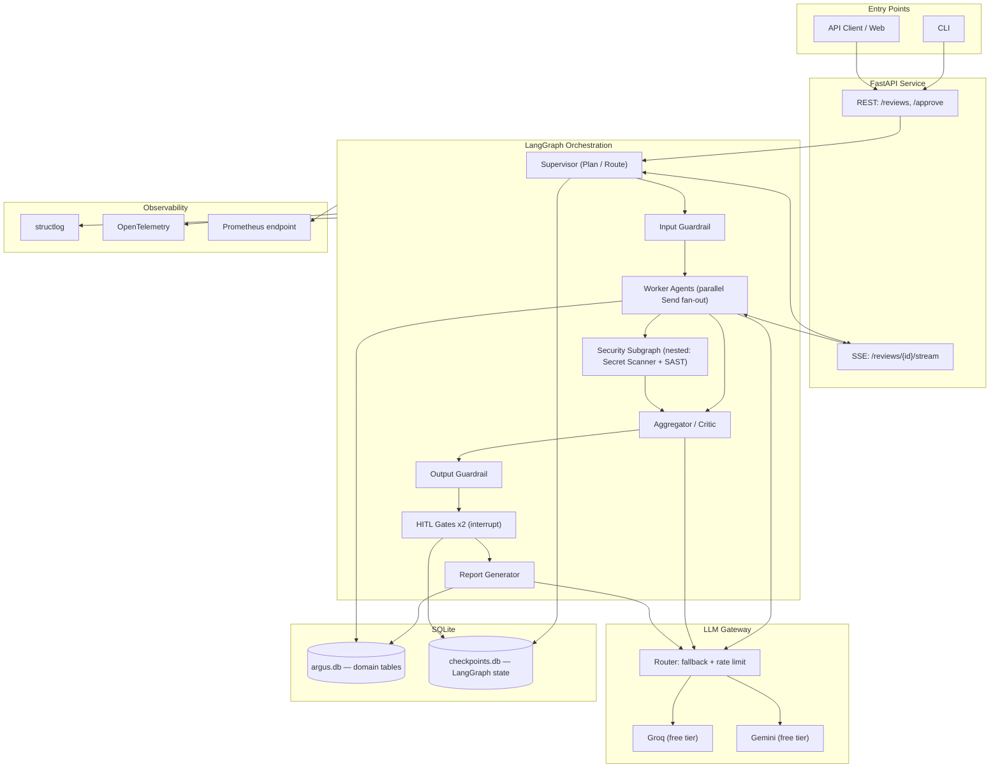
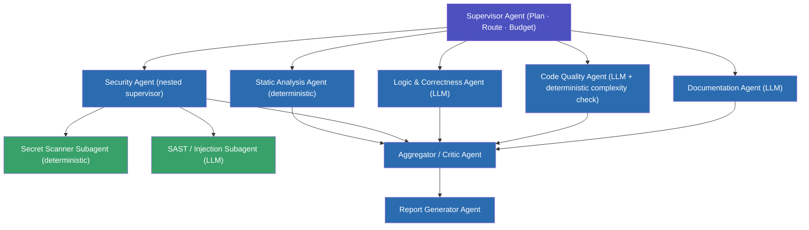
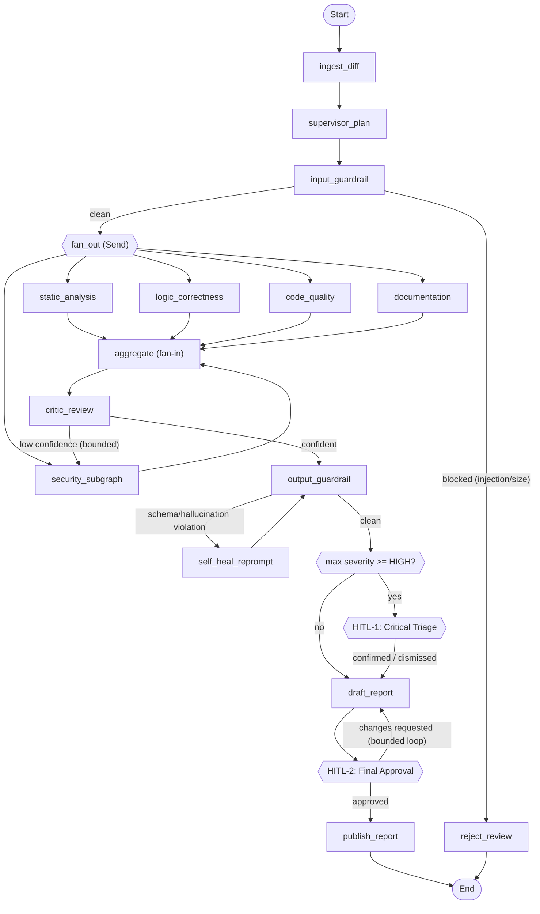
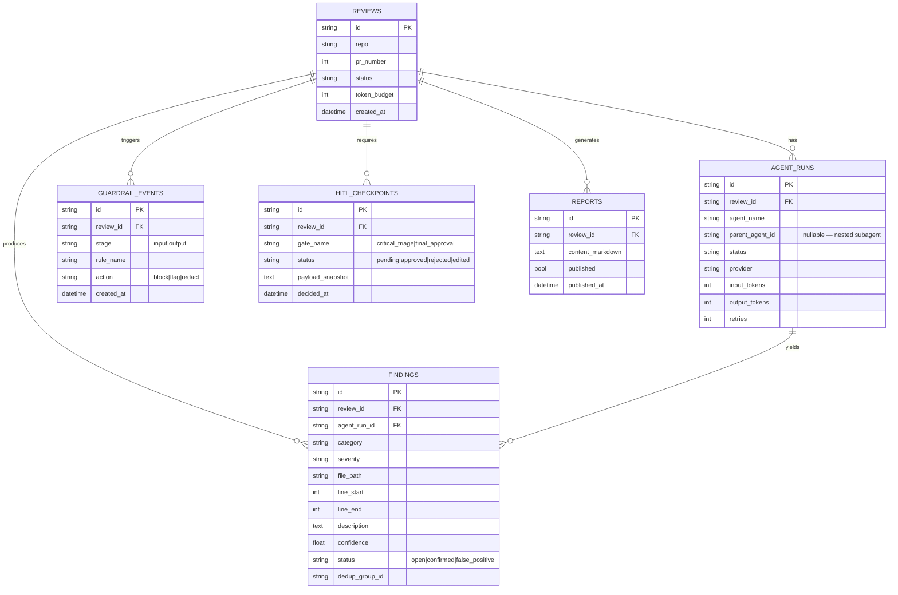

# Argus — Multi-Agent AI Code Review System

**Architecture Document (Portfolio Edition)**

| | |
|---|---|
| **Status** | Draft v2.0 — scoped for solo build |
| **Purpose** | Resume/interview-grade demonstration of applied multi-agent systems engineering |
| **License** | MIT, $0 required infrastructure |

> Argus (Greek: *Panoptes*, "the all-seeing") was set to watch without ever fully sleeping — many specialized eyes, one accountable supervisor.

---

## Why this version exists

The original v1.0 architecture (30 milestones, 3-tier nested agent hierarchy, Docker sandboxing, full Prometheus/Grafana/Jaeger stack, online eval feedback loop, Postgres migration path) is closer to a small platform team's roadmap than something one person ships as a portfolio project. This document keeps every concept a Senior/Lead AI Engineer interview actually probes for — **multi-agent orchestration, human-in-the-loop, durable checkpointing, guardrails, and observability** — and cuts everything else to a clearly-labeled "later" list.

### In scope for v1 (the 15 milestones)

- Supervisor–worker multi-agent orchestration with **real parallel fan-out** (LangGraph `Send` API)
- **One nested subgraph** (Security) to prove recursive multi-agent composition — not two, that's repetition of the same pattern
- **Human-in-the-loop** via `interrupt()` at two gates (critical-finding triage, final approval), resumable after a process restart
- **Durable checkpointing** (`SqliteSaver`) — this is what makes HITL survive a restart, not a nice-to-have
- **Guardrails** at input (prompt injection, size limits) and output (schema validation, hallucination/citation check, secret redaction)
- **Observability**: structured logs + OpenTelemetry traces sharing one `review_id`, a metrics endpoint
- LLM Gateway with provider fallback (Groq + Gemini, both free-tier)
- FastAPI service with SSE streaming, plus a CLI for local/CI use
- A lightweight evaluation harness (small golden dataset, precision/recall) — kept, because "how do you know your agent got better" is one of the highest-signal interview questions

### Deferred — plug in later, once the core works

| Feature | Why deferred |
|---|---|
| Docker-sandboxed tool execution | Real security hardening, but orthogonal to demonstrating multi-agent/HITL/guardrail skills — swap in once the core graph is solid |
| Second nested subgraph (Code Quality) | One nested subgraph already proves the pattern; a second is repetition, not new signal |
| Third HITL gate (pre-flight plan approval) | Two gates already demonstrate `interrupt()`, resumability, and conditional gating |
| Prometheus + Grafana + Jaeger dashboards | The metrics/traces exist from M12 onward; wiring a dashboard is a config exercise, not new engineering |
| Online eval feedback loop (HITL decisions → rolling metrics) | Offline eval alone already shows eval-driven development; online loop is a natural v2 addition |
| Postgres migration / multi-tenant scale | SQLite is correct for a single-deployment CI tool; documented as a future config change, not built now |
| Additional review domains (test-gen, IaC, license compliance) | The `BaseAgent` registry is designed so these are additive — build one to prove it, don't build five |
| Auto-fix PRs, semantic memory, chat-ops approvals | Genuinely "later" — nice interview talking points as "roadmap," not build targets |

Keeping this list *in the document* is itself part of the signal: it shows you can scope deliberately rather than over-engineer.

---

## 1. System Goals

**Functional**
- Decompose review into independent domains, each owned by a worker agent, executed **in parallel**.
- One domain (Security) is a **nested subgraph** with its own internal fan-out, proving the hierarchy is recursive/extensible without touching the parent graph.
- Require **explicit human approval** before anything is published.
- Stream real-time per-agent progress over SSE.
- Run identically as a long-lived API service or a stateless CLI/CI job.
- Operate on **free-tier LLM APIs only** (Groq, Gemini) — $0 required spend.
- Treat the diff as **untrusted input**; defend against prompt injection.
- Prove review quality improves measurably over time (offline eval).

**Non-functional**

| Dimension | Target |
|---|---|
| Latency | P50 < 90s for diffs under ~400 changed lines |
| Cost | $0 required infra; bounded by free-tier rate limits |
| Reliability | One worker failing never fails the whole review |
| Observability | Every LLM call, retry, and human decision traceable via one `review_id` |
| Portability | Single SQLite file + single Python process |

**Non-goals**: multi-tenant SaaS, model fine-tuning, universal language support on day one (Python/JS/TS only).

---

## 2. High-Level Architecture



Three planes: **control** (FastAPI + streaming), **orchestration** (LangGraph graph, workers, guardrails, HITL), **data** (SQLite for domain rows and durable checkpoints). The LLM Gateway is first-class, not a helper function — two providers with different rate limits means routing/fallback is real architecture, not boilerplate.

---

## 3. Agent Hierarchy



**Five L1 workers** (one nested), not seven — enough to show breadth (deterministic + LLM, parallel + nested) without three agents that all say "review this diff for X." `Security` is a **compiled LangGraph subgraph** used as a single node in the parent graph — the parent doesn't know or care that it internally fans out to two subagents and joins them. That mechanism (`StateGraph` as a node inside a parent `StateGraph`) is the whole point of the milestone; a second nested domain would just repeat it.

| Agent | Type | Responsibility | Output |
|---|---|---|---|
| Supervisor | LLM + rules | Builds review plan, owns budget/retry/guardrail policy | `ReviewPlan`, dispatch |
| Static Analysis | Deterministic + LLM summary | Runs linters/type-checkers, normalizes to `Finding` | `Finding[]` (style/type) |
| Security (supervisor) | Orchestrator | Fans out to 2 subagents, merges, assigns severity | Aggregated security findings |
| ↳ Secret Scanner | Deterministic | Entropy/regex leaked-credential detection | `Finding[]` (`leaked_secret`) |
| ↳ SAST / Injection | LLM | Injection, SSRF, authZ/authN flaws | `Finding[]` (`security_flaw`) |
| Logic & Correctness | LLM | Behavioral bugs, edge cases, coverage gaps | `Finding[]` (`logic_bug`) |
| Code Quality | LLM + deterministic complexity | Style, naming, complexity threshold | `Finding[]` (`quality`) |
| Documentation | LLM | Docstring/README completeness vs. code change | `Finding[]` (`missing_docs`) |
| Aggregator / Critic | LLM | Dedupe overlap, resolve severity conflicts, decide refine loop | `AggregatedFindings` |
| Guardrail Layer | Rules + classifier | Input/output validation at every boundary | Pass / Block / Flag |
| Report Generator | LLM | Synthesizes final Markdown report | `report.md` |

---

## 4. LangGraph Workflow



**Key LangGraph mechanisms used:**
- **`Send` API** for dynamic parallel fan-out — the worker list is data, not hardcoded edges, so adding a domain doesn't touch the graph.
- **Subgraph composition** for the Security nested supervisor.
- **Conditional edges** for the critic's refine loop and the final-approval "changes requested" loop — both bounded by a retry counter so every run terminates.
- **`interrupt()`** for both HITL gates — pauses execution and durably checkpoints state; resumes only via `Command(resume=decision)`.
- **`SqliteSaver`** checkpointer — every node transition persisted, so a paused review survives a process restart or days of waiting on a human.

```python
from langgraph.graph import StateGraph, START, END
from langgraph.types import Send, interrupt
from langgraph.checkpoint.sqlite import SqliteSaver

WORKERS = ["static_analysis", "security_supervisor", "logic_correctness",
           "code_quality", "documentation"]

def fan_out(state: ReviewState):
    return [Send(name, state) for name in WORKERS]

graph = StateGraph(ReviewState)
# ... add_node for each worker, aggregate, critic_review, output_guardrail,
#     draft_report, final_approval_gate (calls interrupt()), publish_report

graph.add_conditional_edges("supervisor_plan", fan_out, WORKERS)
for w in WORKERS:
    graph.add_edge(w, "aggregate")   # fan-in barrier

app = graph.compile(checkpointer=SqliteSaver.from_conn_string("data/checkpoints.db"))
```

```python
def final_approval_node(state: ReviewState) -> dict:
    decision = interrupt({
        "gate": "final_approval",
        "report_preview": state["report_markdown"],
        "risk_summary": summarize_risk(state["aggregated_findings"]),
    })
    if decision["action"] == "reject":
        return {"status": "rejected"}
    if decision["action"] == "request_changes":
        return {"status": "reporting", "hitl_decisions": {"final_approval": decision}}
    return {"status": "published", "hitl_decisions": {"final_approval": decision}}
```

**HITL in CI.** A CI job can't render a UI. The CLI posts a PR comment summarizing what needs approval (`/argus approve`), polls `GET /reviews/{id}` until the status leaves `awaiting_human`, and fails the check on timeout — **fail-safe default blocks the merge**, never silently proceeds.

---

## 5. Database Schema

Two SQLite files, distinct ownership:
- `checkpoints.db` — owned entirely by LangGraph's `SqliteSaver`. Never written to directly.
- `argus.db` — the domain schema below.



`EVAL_RUNS` / `EVAL_CASES` and `AUDIT_LOG` (append-only accountability trail) are added in M14/later — deliberately not part of the core schema so the first working graph isn't blocked on tables it doesn't need yet.

**Notes:**
- `agent_runs.parent_agent_id` self-references, modeling nested subagents.
- `findings.dedup_group_id` lets the Aggregator mark duplicates without deleting originals.
- SQLite runs in **WAL mode** for concurrent readers with a single writer.

---

## 6. Folder Structure

```
argus/
├── src/argus/
│   ├── api/                # FastAPI: main.py, routers/{reviews,approvals,stream}.py
│   ├── graph/               # LangGraph: state.py, supervisor.py, routing.py, nodes/
│   ├── agents/
│   │   ├── base.py          # BaseAgent Protocol + registry.py
│   │   ├── static_analysis/
│   │   ├── security/        # supervisor.py (subgraph) + secret_scanner.py + sast_agent.py
│   │   ├── logic/
│   │   ├── code_quality/
│   │   ├── documentation/
│   │   ├── aggregator.py
│   │   └── report_generator.py
│   ├── guardrails/          # schemas.py (Pydantic contracts), input.py, output.py
│   ├── llm/                 # provider.py, router.py, rate_limiter.py
│   ├── persistence/         # models.py (SQLModel), db.py, repository.py
│   ├── observability/       # logging.py, tracing.py, metrics.py, decorators.py
│   ├── eval/                # offline/harness.py, offline/judge.py
│   ├── cli.py
│   └── config.py
├── eval_datasets/            # versioned fixture PRs w/ hand-labeled findings
├── tests/{unit,integration,eval}/
├── .github/workflows/argus-review.yml
├── docker-compose.yml        # app only for v1; add Jaeger/Grafana later
└── pyproject.toml
```

---

## 7. Design Principles

1. **Deterministic before probabilistic.** Time math, auth, ownership, complexity thresholds are code, not prompts.
2. **Guardrails are structural, not bolted on.** The diff is untrusted input; every prompt boundary validates in, every LLM response validates out.
3. **Schema-constrained outputs.** Every LLM response is Pydantic-validated; malformed output triggers self-heal, never silent acceptance.
4. **Bounded everything.** Every loop (critic refine, self-heal, changes-requested) has a retry counter — every run terminates.
5. **Extensibility falls out of the pattern.** A new domain = a new worker registered in the fan-out list; no existing agent or edge changes (Open/Closed Principle applied at the system level).
6. **Checkpointing is about correctness, observability is about explainability.** Don't conflate the two — `SqliteSaver` answers "can this paused run resume faithfully," traces/logs answer "why did this happen."

**Why Supervisor–Worker over alternatives:** mirrors how human review teams actually work (specialists work independently, someone synthesizes); enables real parallelism, the dominant lever for latency; bounded context per worker beats one mega-prompt on both accuracy and cost. A fully decentralized peer-to-peer pattern (AutoGen-style group chat) was considered and rejected — nondeterministic turn-taking is a poor fit for a system that has to be bounded and auditable enough to gate a merge.

**Why SQLite over Postgres/Redis for v1:** workload is bounded concurrency (one graph execution per review), zero-ops is a real requirement for a tool meant to run inside a CI runner with no managed DB credentials, and LangGraph ships a first-class `SqliteSaver` with no adapter work. Migration path (swap connection string, run Alembic, switch to LangGraph's Postgres checkpointer) is documented, not built — paying for that complexity before it's needed violates YAGNI for a single-deployment tool.

---

## 8. Guardrails (Input / Output)

**Input, before any LLM sees the diff:**
- Prompt-injection pattern detection ("ignore previous instructions," embedded system-prompt lookalikes) — diff content is always passed as clearly delimited *data*, never concatenated into instruction text.
- Size limits — oversized diffs are rejected or chunked with an explicit token budget.

**Output, before any LLM response is trusted:**
- Pydantic schema validation on every structured response — failure triggers the self-heal loop.
- Hallucination check — every finding's cited file/line is verified against the actual diff; unverifiable citations are downgraded to `low_confidence`, never silently dropped.
- Secret/PII redaction — only the Secret Scanner's structured metadata (file/line/rule) is ever shown, never the raw secret.

**Cost guardrails (also a security concern for anything public-facing):** per-provider rate limiting, a per-review token/retry budget, circuit breakers on repeated provider failure.

Every guardrail decision (block/flag/redact) writes to `guardrail_events` — any published or blocked finding can be explained after the fact.

---

## 9. Observability

- **Structured logs** (structlog) bound to `review_id` for every log line.
- **OpenTelemetry traces** — one span per node execution via a `@traced_node` decorator, so instrumenting a new agent requires zero changes to that agent's own function body.
- **Metrics endpoint** (Prometheus format) — LLM call count by provider, retry count, HITL wait duration.
- Every LLM call, tool call, retry, and human decision is traceable end-to-end via the single `review_id` — this is the concrete, testable version of "observability," not a slide bullet.

Dashboards (Grafana/Jaeger) are a config exercise on top of this and are explicitly deferred — the instrumentation, which is the actual engineering, ships in M12.

---

## 10. Tech Stack

| Layer | Technology | Why |
|---|---|---|
| Orchestration | LangGraph | Graph control flow, native parallel fan-out, checkpointing, `interrupt()` |
| API | FastAPI (async) | Native SSE support, pairs with LangGraph's async execution |
| LLM providers | Groq + Gemini (free tier) | $0 cost; complementary latency/context tradeoffs; forces a real gateway abstraction |
| Persistence | SQLite (WAL) via SQLModel | Zero-ops, native LangGraph checkpointer support |
| Validation | Pydantic v2 | Contract-first schemas for state, findings, structured LLM output |
| Static analysis | ruff, eslint, mypy/tsc | Deterministic, fast, free baselines feeding LLM agents |
| Retries | tenacity | Exponential backoff + jitter |
| Observability | structlog, OpenTelemetry | Fully open-source, no vendor lock-in |
| Evaluation | pytest-based harness + LLM-as-judge | Zero-cost, full control over the rubric |
| CI | GitHub Actions | Native target environment |

---

## 11. Future Extensions (explicitly out of the 15 milestones)

- Docker-sandboxed tool execution for untrusted-diff hardening
- Second nested subgraph (Code Quality: complexity/style/duplication as subagents)
- Third HITL gate (pre-flight plan approval for oversized diffs)
- Full Prometheus + Grafana + Jaeger dashboard stack
- Online eval: aggregate live HITL decisions into rolling override-rate / false-positive-rate metrics, feed dismissed findings back into the golden dataset
- Postgres + LangGraph Postgres checkpointer for multi-tenant scale
- New review domains via the `BaseAgent` registry (test generation, IaC review, license compliance)
- Auto-fix PRs, semantic memory of repo-specific false positives, chat-ops (Slack) approvals
- Multi-LLM ensemble voting on `critical`-severity findings only
